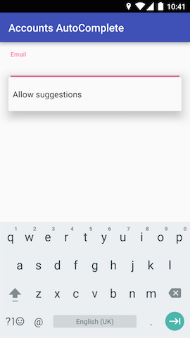
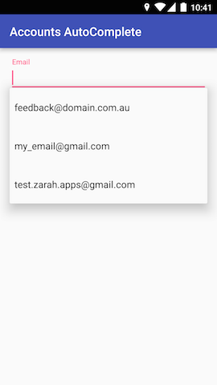

# accounts-autocomplete
An M-compatible custom AutoCompleteTextView that shows the user's Google accounts as autocomplete suggestions.  

This widget is based on the GMail behaviour of subtly asking for permissions for autcompleting email addresses.  

Before permission is granted:  


After permission is granted:  


## Usage
Drop in `au.com.domain.AccountsAutoCompleteTextView` in your layout and set it up in the `Activity`:
```java
mAccountsAutoCompleteTextView.setParentActivity(this);
```
or `Fragment`:
```java
mAccountsAutoCompleteTextView.setParentFragment(this);
```

You would then need to override the `onRequestPermissionsResult` callback:
```java
@Override
    public void onRequestPermissionsResult(int requestCode, @NonNull String[] permissions, @NonNull int[] grantResults) {
        mAccountsAutoCompleteTextView.onPermissionResponse(requestCode, permissions, grantResults);
    }
```

And that's it.
